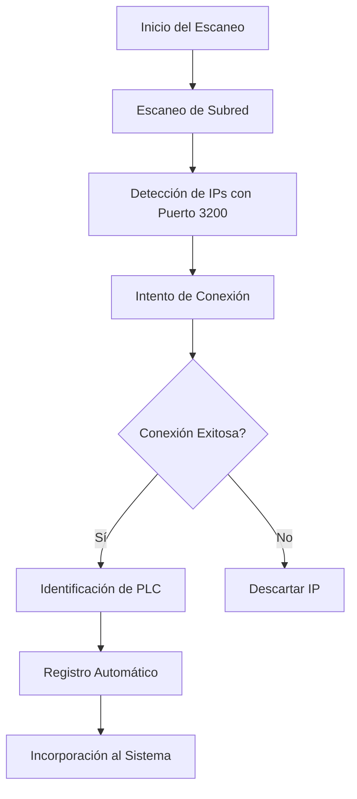
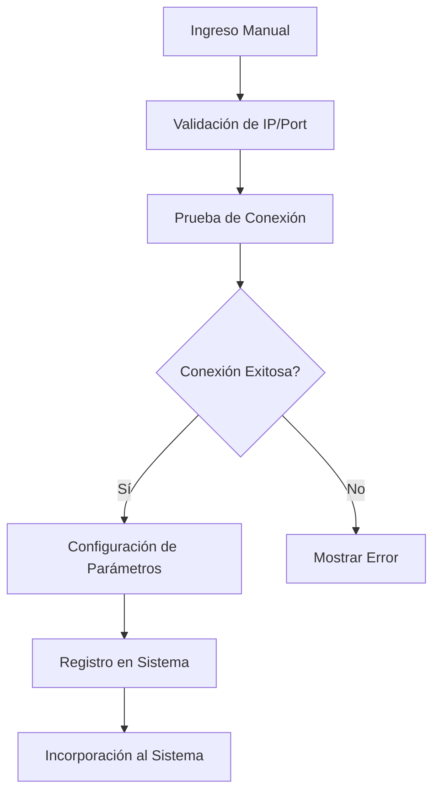
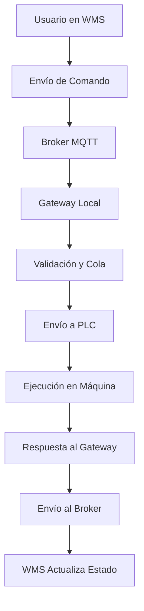
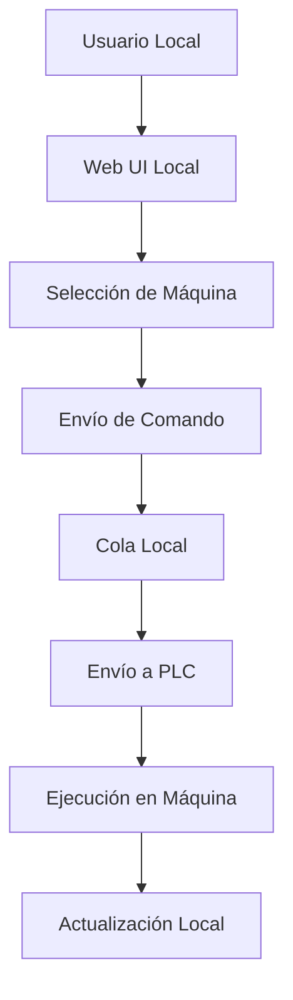

# 🏗️ Arquitectura de Gateway Local para WMS Multi-Tenant en la Nube

## 📋 Resumen Ejecutivo

Documento técnico que detalla la arquitectura del sistema Carousel API como **Gateway Local** que puede operar de manera **independiente** o conectarse con un **WMS Multi-Tenant en la nube**. Esta arquitectura permite una solución híbrida donde el Gateway puede funcionar con nuestro WMS o con WMS de terceros, sin limitar al cliente que solo desee adquirir las máquinas.

---

## 🎯 Objetivo del Sistema

Transformar el Carousel API en un **Gateway Local** que:

1. **Opere de manera independiente** sin requerir nuestro WMS
2. **Comunique con nuestro WMS Multi-Tenant** en la nube cuando se desee
3. **Sea compatible con WMS de terceros** mediante APIs estándar
4. **Gestione localmente los racks de almacenamiento vertical** con cangilones móviles
5. **Descubra automáticamente máquinas** en la red local
6. **Mantenga comunicación segura y eficiente** con la nube
7. **Opere de forma autónoma** en caso de pérdida de conectividad

---

## 🏛️ Arquitectura General del Sistema

### Diagrama de Arquitectura

```
┌─────────────────────────────────────────────────────────────────────────────────────┐
│                          OPCIONES DE INTEGRACIÓN                                    │
├─────────────────────────────────────────────────────────────────────────────────────┤
│  🚫 SIN WMS (Modo Independiente)    🌐 CON NUESTRO WMS    🤝 CON WMS DE TERCEROS   │
│                                     (Multi-Tenant)        (APIs Estándar)          │
├─────────────────────────────────────┬───────────────────────────────────────────────┤
│                                     │                                               │
│                                     ▼                                               │
│                   ┌─────────────────────────────────────────────┐                   │
│                   │        BROKER DE COMUNICACIÓN               │                   │
│                   │         (MQTT/WebSocket)                    │                   │
│                   └─────────────────────────────────────────────┘                   │
└─────────────────────────────────────┬───────────────────────────────────────────────┘
                                      │
                                      ▼
┌─────────────────────────────────────┼───────────────────────────────────────────────┐
│        INFRAESTRUCTURA DEL CLIENTE  │                                               │
├─────────────────────────────────────┼───────────────────────────────────────────────┤
│              ┌──────────────────────▼────────────────────────┐                     │
│              │        GATEWAY LOCAL (Carousel API)           │                     │
│              │                                               │                     │
│              │  🔄 Gestor Multi-PLC         🌐 API REST      │                     │
│              │  🔌 WebSocket Server         🎮 Simulador     │                     │
│              │  🛡️ Autenticación Segura    📦 Cola de Comandos│                     │
│              │  🔄 Sincronización Local     📈 Métricas Locales│                     │
│              │  🔍 Descubrimiento Automático 🖥️ Web UI Local  │                     │
│              └───────────────────────────────────────────────┘                     │
│                                      │                                            │
│                                      ▼                                            │
│                            ┌──────────────────┐                                  │
│                            │  RACKS VERTICALES│                                  │
│                            │   CON CANGILONES │                                  │
│                            │                  │                                  │
│                            │  🏭 PLC #1       │                                  │
│                            │  🏭 PLC #2       │                                  │
│                            │  🏭 PLC #N       │                                  │
│                            └──────────────────┘                                  │
└────────────────────────────────────────────────────────────────────────────────────┘
```

---

## 🧩 Componentes del Sistema

### 1. WMS Multi-Tenant (Opcional - Nube)

#### Características Principales

- **Multi-Tenant**: Un solo sistema gestionando múltiples clientes
- **Escalabilidad**: Capaz de crecer con la demanda
- **Centralización**: Actualizaciones y mantenimiento centralizados
- **Seguridad**: Protección de datos de todos los clientes

#### Funcionalidades

- Gestión completa de inventario
- Procesos de entrada y salida
- Informes y analíticas avanzadas
- Integraciones con ERP y transportistas
- Panel de control web

### 2. Gateway Local (Carousel API)

#### Rol del Gateway

El Carousel API se transforma en un **Gateway Local** completamente autónomo que puede operar independientemente o conectarse con cualquier WMS compatible.

#### Funcionalidades del Gateway

1. **Comunicación con PLCs**

   - Gestión de múltiples conexiones PLC
   - Protocolos industriales estándar
   - Simulador para pruebas

2. **Comunicación con WMS (Opcional)**

   - Conexión segura con nuestro WMS Multi-Tenant
   - Compatibilidad con WMS de terceros
   - Autenticación y autorización
   - Manejo de desconexiones temporales

3. **Gestión Local**

   - Cola de comandos local
   - Caché de estado
   - Métricas y monitoreo local
   - **Web UI Local** para configuración independiente

4. **Descubrimiento Automático**

   - **Escaneo de red** para encontrar PLCs
   - Configuración automática de máquinas descubiertas
   - Registro manual de máquinas

5. **Autonomía**
   - Operación sin conexión a la nube
   - Sincronización cuando se restablece la conexión
   - Modo independiente completo

### 3. Racks Verticales con Cangilones

#### Componentes

- PLCs industriales
- Motores y sensores
- Cangilones móviles como ascensores
- Interface hombre-máquina (HMI)

#### Comunicación

- Protocolos industriales estándar
- Comunicación con el Gateway Local

---

## 🔌 Comunicación entre Componentes

### 1. WMS ↔ Gateway Local (Opcional)

#### Protocolos de Comunicación

- **MQTT**: Broker central para comunicación eficiente
- **WebSocket**: Comunicación bidireccional en tiempo real
- **HTTPS/REST**: APIs para operaciones específicas

#### Flujo de Comunicación

```
WMS Cloud → Comando → Broker MQTT → Gateway Local → PLC
PLC → Telemetría → Gateway Local → Broker MQTT → WMS Cloud
```

#### Seguridad

- Autenticación JWT
- Encriptación TLS
- Tokens específicos por cliente e instalación

### 2. Gateway Local ↔ PLCs

#### Protocolos Soportados

- Modbus TCP/IP
- Siemens S7
- Allen-Bradley Ethernet/IP
- Protocolos personalizados

#### Gestión de Conexiones

- Pool de conexiones
- Reintento automático
- Circuit breakers

### 3. Interfaz Local (Modo Independiente)

#### Web UI Local

- Configuración de máquinas
- Visualización de estado
- Ejecución manual de comandos
- Gestión de usuarios locales

---

## 🔍 Descubrimiento Automático de Máquinas

### Proceso de Escaneo

#### Escaneo de Red

1. **Detección de PLCs**: Escaneo automático de IPs en subred
2. **Identificación de Puertos**: Verificación de puerto estándar (3200)
3. **Validación de Protocolo**: Confirmación de comunicación PLC
4. **Registro Automático**: Incorporación al sistema

#### Configuración Manual

1. **Ingreso de IP/Port**: Registro manual de PLCs
2. **Configuración de Parámetros**: Nombre, tipo, características
3. **Prueba de Conexión**: Validación de comunicación
4. **Incorporación al Sistema**: Registro en base de datos local

### Interfaz de Gestión de Máquinas

#### Panel de Control Local

```json
{
  "machines": [
    {
      "id": "machine_001",
      "name": "Rack Vertical A",
      "ip": "192.168.1.50",
      "port": 3200,
      "status": "connected",
      "type": "vertical_carousel",
      "last_seen": "2025-01-27T10:30:00Z",
      "positions": 255,
      "current_position": 45
    },
    {
      "id": "machine_002",
      "name": "Rack Vertical B",
      "ip": "192.168.1.51",
      "port": 3200,
      "status": "disconnected",
      "type": "vertical_carousel",
      "last_seen": "2025-01-26T15:45:00Z",
      "positions": 255,
      "current_position": 0
    }
  ]
}
```

---

## 🛡️ Seguridad y Autenticación

### Modelo de Seguridad

#### 1. Autenticación en la Nube

- **Usuarios del WMS**: Autenticación centralizada
- **Tokens JWT**: Para acceso a APIs
- **OAuth 2.0**: Para integraciones

#### 2. Autenticación Gateway

- **Token de Instalación**: Identifica al gateway único
- **Certificados**: Para comunicación segura
- **Rotación Automática**: De credenciales

#### 3. Comunicación Segura

- **TLS 1.3**: En todas las comunicaciones
- **Validación de Certificados**: Extremo a extremo
- **Filtrado de Datos**: Solo se envían datos necesarios

#### 4. Acceso Local

- **Usuarios Locales**: Para modo independiente
- **Roles y Permisos**: Control de acceso local
- **Autenticación Local**: Sin dependencia de la nube

### Roles y Permisos

#### En el WMS Nube

| Rol             | Permisos                            |
| --------------- | ----------------------------------- |
| tenant_admin    | Acceso completo al tenant           |
| tenant_operator | Operaciones de día a día            |
| tenant_viewer   | Solo lectura                        |
| system_admin    | Administración del sistema completo |

#### En el Gateway Local

| Rol              | Permisos                          |
| ---------------- | --------------------------------- |
| gateway_admin    | Configuración y mantenimiento     |
| gateway_operator | Operaciones normales              |
| local_technician | Acceso físico y mantenimiento     |
| local_viewer     | Solo lectura (modo independiente) |

---

## 📦 Modelo de Datos Local

### Estructura de Datos Local

#### Tabla de Máquinas

```sql
Tabla: machines
- machine_id (PK)
- name
- ip_address
- port
- protocol
- status
- type
- positions
- created_at
- last_seen
```

#### Tabla de Comandos

```sql
Tabla: commands
- command_id (PK)
- machine_id (FK)
- action
- parameters
- status
- created_at
- executed_at
```

#### Tabla de Posiciones

```sql
Tabla: positions
- position_id (PK)
- machine_id (FK)
- position_number
- item_id
- quantity
- last_updated
```

#### Tabla de Usuarios Locales

```sql
Tabla: local_users
- user_id (PK)
- username
- password_hash
- role
- created_at
- last_login
```

---

## 🔄 Flujos de Negocio Clave

### 1. Descubrimiento Automático de Máquinas



### 2. Registro Manual de Máquinas



### 3. Comando desde WMS a Máquina



### 4. Operación en Modo Independiente



---

## 📡 APIs de Comunicación

### 1. API del WMS Nube

#### Endpoints Principales

```
POST /api/v1/commands
GET /api/v1/status
GET /api/v1/tenants/{tenant_id}/installations
GET /api/v1/installations/{installation_id}/machines
```

#### Formato de Comandos

```json
{
  "command_id": "cmd_12345",
  "installation_id": "inst_67890",
  "target": "machine_001",
  "action": "move_to_position",
  "parameters": {
    "position": 15
  },
  "timestamp": "2025-01-27T10:30:00Z"
}
```

### 2. API del Gateway Local

#### Endpoints Principales

```
POST /api/v1/commands/execute
GET /api/v1/status
GET /api/v1/machines
POST /api/v1/machines/discover
POST /api/v1/machines/register
POST /api/v1/sync
GET /api/v1/local/auth/login
```

#### Configuración del Gateway

```json
{
  "gateway": {
    "id": "gw_xyz_001",
    "name": "Gateway Almacén Principal",
    "version": "2.6.0",
    "mode": "standalone" // or "connected"
  },
  "network": {
    "scan_subnet": "192.168.1.0/24",
    "plc_port": 3200,
    "listen_port": 8181,
    "websocket_port": 8765
  },
  "cloud": {
    "broker_url": "mqtt://wms.example.com",
    "api_url": "https://wms.example.com/api/v1",
    "auth_token": "eyJhbGciOiJIUzI1NiIsInR5cCI6IkpXVCJ9...",
    "enabled": true
  }
}
```

---

## 🛠️ Configuración y Despliegue

### 1. Configuración del Gateway

#### Archivo de Configuración

```json
{
  "gateway": {
    "id": "gw_xyz_001",
    "name": "Gateway Almacén Principal",
    "version": "2.6.0",
    "mode": "standalone"
  },
  "discovery": {
    "auto_scan_enabled": true,
    "scan_interval_minutes": 30,
    "scan_subnet": "192.168.1.0/24",
    "plc_port": 3200,
    "timeout_seconds": 5
  },
  "cloud": {
    "broker_url": "mqtt://wms.example.com",
    "api_url": "https://wms.example.com/api/v1",
    "auth_token": "TOKEN_SECRETO",
    "enabled": false,
    "reconnect_interval": 5,
    "heartbeat_interval": 30
  },
  "local": {
    "machines": [
      {
        "id": "machine_1",
        "name": "Rack Vertical A",
        "ip": "192.168.1.50",
        "port": 3200,
        "protocol": "modbus",
        "enabled": true
      }
    ],
    "network": {
      "listen_port": 8181,
      "websocket_port": 8765
    }
  },
  "security": {
    "tls_enabled": true,
    "cert_file": "/etc/gateway/cert.pem",
    "key_file": "/etc/gateway/key.pem"
  }
}
```

### 2. Despliegue del Gateway

#### Opciones de Despliegue

1. **Docker Container**

   ```dockerfile
   FROM python:3.9-slim
   COPY . /app
   WORKDIR /app
   RUN pip install -r requirements.txt
   CMD ["python", "main.py"]
   ```

2. **Ejecutable Standalone**

   ```bash
   pyinstaller --onefile main.py
   ./dist/carousel_gateway
   ```

3. **Servicio del Sistema**

   ```systemd
   [Unit]
   Description=Carousel Gateway Service
   After=network.target

   [Service]
   Type=simple
   User=carousel
   WorkingDirectory=/opt/carousel_gateway
   ExecStart=/opt/carousel_gateway/carousel_gateway
   Restart=always

   [Install]
   WantedBy=multi-user.target
   ```

---

## 📈 Métricas y Monitoreo

### 1. Métricas del Gateway Local

#### Métricas de Sistema

- Uso de CPU y memoria
- Conectividad de red
- Estado de conexiones PLC
- Latencia de comandos

#### Métricas de Negocio

- Operaciones por hora
- Tasa de éxito de comandos
- Tiempo promedio de posicionamiento
- Disponibilidad de máquinas

#### Formato de Métricas (Prometheus)

```
gateway_cpu_usage_percent{gateway_id="gw_xyz_001"} 25.3
gateway_memory_usage_mb{gateway_id="gw_xyz_001"} 128
gateway_plc_connections_active{gateway_id="gw_xyz_001",plc_id="machine_1"} 1
gateway_commands_processed_total{gateway_id="gw_xyz_001",status="success"} 1250
```

### 2. Monitoreo en la Nube

#### Dashboard de Tenants

- Estado de gateways por tenant
- Métricas agregadas
- Alertas de conectividad
- Historial de operaciones

#### Alertas

- Gateway desconectado
- Errores en comandos
- Problemas de conectividad PLC
- Uso excesivo de recursos

---

## 🔧 Plan de Implementación

### Fase 1: Funcionalidad Básica del Gateway (Semanas 1-3)

#### Tarea 1.1: Implementación del Gestor de PLCs

- **Duración**: 1 semana
- **Objetivo**: Conexión y control básico de PLCs
- **Acciones**:
  - Implementar protocolos de comunicación
  - Crear pool de conexiones
  - Agregar mecanismos de reintento

#### Tarea 1.2: Web UI Local

- **Duración**: 1 semana
- **Objetivo**: Interfaz para modo independiente
- **Acciones**:
  - Crear frontend web básico
  - Implementar autenticación local
  - Agregar gestión de máquinas

#### Tarea 1.3: Sistema de Comandos Local

- **Duración**: 1 semana
- **Objetivo**: Cola y ejecución de comandos
- **Acciones**:
  - Implementar cola de comandos
  - Agregar persistencia local
  - Crear API REST local

### Fase 2: Descubrimiento Automático (Semanas 4-5)

#### Tarea 2.1: Escaneo de Red

- **Duración**: 1 semana
- **Objetivo**: Descubrimiento automático de PLCs
- **Acciones**:
  - Implementar escaneo de subred
  - Agregar detección de puertos
  - Crear validación de protocolos

#### Tarea 2.2: Registro Automático

- **Duración**: 1 semana
- **Objetivo**: Incorporación automática de máquinas
- **Acciones**:
  - Crear sistema de registro automático
  - Agregar configuración por defecto
  - Implementar notificaciones de descubrimiento

### Fase 3: Comunicación con la Nube (Semanas 6-7)

#### Tarea 3.1: Cliente MQTT/WebSocket

- **Duración**: 1 semana
- **Objetivo**: Comunicación segura con WMS
- **Acciones**:
  - Implementar cliente MQTT
  - Agregar autenticación JWT
  - Crear mecanismos de reconexión

#### Tarea 3.2: Sincronización de Datos

- **Duración**: 1 semana
- **Objetivo**: Intercambio de datos con la nube
- **Acciones**:
  - Implementar envío de telemetría
  - Agregar recepción de comandos
  - Crear mecanismos de sincronización

### Fase 4: Seguridad y Monitoreo (Semanas 8-9)

#### Tarea 4.1: Implementación de Seguridad

- **Duración**: 1 semana
- **Objetivo**: Seguridad robusta del gateway
- **Acciones**:
  - Implementar TLS
  - Agregar autenticación local
  - Crear gestión de certificados

#### Tarea 4.2: Sistema de Métricas

- **Duración**: 1 semana
- **Objetivo**: Monitoreo completo del sistema
- **Acciones**:
  - Integrar cliente Prometheus
  - Crear métricas de sistema
  - Implementar dashboard local

### Fase 5: Pruebas y Validación (Semanas 10-11)

#### Tarea 5.1: Pruebas de Integración

- **Duración**: 1 semana
- **Objetivo**: Validar integración completa
- **Acciones**:
  - Crear entorno de pruebas
  - Validar flujos de negocio
  - Probar escenarios de error

#### Tarea 5.2: Pruebas de Carga

- **Duración**: 1 semana
- **Objetivo**: Validar rendimiento del gateway
- **Acciones**:
  - Simular múltiples máquinas
  - Probar concurrencia
  - Validar tiempos de respuesta

---

## 🧪 Pruebas y Validación

### Pruebas Unitarias

#### Componentes del Gateway

- Cliente MQTT/WebSocket
- Gestor de PLCs
- Cola de comandos
- Sistema de descubrimiento
- Web UI local

#### Comunicación

- Autenticación
- Encriptación
- Manejo de errores

### Pruebas de Integración

#### Con WMS en la Nube

- Registro de gateway
- Envío de comandos
- Recepción de telemetría
- Manejo de desconexiones

#### Con PLCs

- Conexión a múltiples PLCs
- Ejecución de comandos
- Recepción de estados
- Manejo de errores

#### Modo Independiente

- Funcionamiento sin conexión
- Web UI local
- Ejecución de comandos locales
- Gestión de usuarios

### Pruebas de Carga

#### Escenarios

- 50+ máquinas conectadas
- 1000+ comandos por hora
- Simulación de desconexiones
- Recuperación automática

---

## 📦 Despliegue y Operación

### Arquitectura de Despliegue

```
┌─────────────────────────────────────────────────────────────┐
│                    INFRAESTRUCTURA NUBE                     │
├─────────────────────────────────────────────────────────────┤
│  ┌─────────────┐  ┌─────────────┐  ┌─────────────────────┐  │
│  │   WMS API   │  │  WMS Web    │  │  Message Broker     │  │
│  │   (NestJS)  │  │  (Next.js)  │  │   (MQTT/WS)         │  │
│  └─────────────┘  └─────────────┘  └─────────────────────┘  │
└─────────────────────────────────────────────────────────────┘

┌─────────────────────────────────────────────────────────────┐
│                 INFRAESTRUCTURA CLIENTE                     │
├─────────────────────────────────────────────────────────────┤
│  ┌─────────────────────────────────────────────────────────┐  │
│  │              GATEWAY LOCAL (Carousel API)              │  │
│  │                                                         │  │
│  │  ┌─────────────┐  ┌─────────────┐  ┌─────────────────┐  │  │
│  │  │  PLC Mgr    │  │  REST API   │  │  MQTT Client    │  │  │
│  │  │             │  │             │  │                 │  │  │
│  │  │  ┌─────────┐│  │  ┌─────────┐│  │  ┌─────────────┐│  │  │
│  │  │  │Scanner  ││  │  │Web UI   ││  │  │Sync Mgr     ││  │  │
│  │  │  └─────────┘│  │  └─────────┘│  │  └─────────────┘│  │  │
│  │  └─────────────┘  └─────────────┘  └─────────────────┘  │  │
│  └─────────────────────────────────────────────────────────┘  │
│                              │                               │
│                              ▼                               │
│                    ┌──────────────────┐                      │
│                    │   RACKS VERTICALES│                      │
│                    │   CON CANGILONES │                      │
│                    └──────────────────┘                      │
└─────────────────────────────────────────────────────────────┘
```

### Monitoreo y Alertas

#### Health Checks

- Estado de conectividad con la nube
- Estado de conexiones PLC
- Uso de recursos del sistema
- Funcionamiento de servicios críticos

#### Alertas Proactivas

- Gateway desconectado
- Errores en comandos
- Problemas de conectividad PLC
- Uso excesivo de recursos

---

## 📝 Conclusión

La transformación del Carousel API en un **Gateway Local** completamente autónomo representa una evolución estratégica que ofrece máxima flexibilidad al cliente. Esta arquitectura permite:

1. **Independencia Total**: Operar sin requerir nuestro WMS
2. **Compatibilidad**: Funcionar con nuestro WMS o WMS de terceros
3. **Descubrimiento Automático**: Encontrar y configurar máquinas automáticamente
4. **Gestión Local**: Web UI para configuración independiente
5. **Escalabilidad**: Soportar múltiples racks verticales
6. **Seguridad Robusta**: Comunicación cifrada y autenticación segura
7. **Autonomía Local**: Operar independientemente en caso de desconexión

Esta solución no limita a los clientes que solo desean adquirir las máquinas, al mismo tiempo que ofrece integración completa con nuestro ecosistema WMS para quienes lo deseen.

El plan de implementación propuesto asegura una transición controlada y progresiva hacia esta nueva arquitectura, manteniendo la funcionalidad existente mientras se agregan capacidades avanzadas de descubrimiento, gestión local y comunicación con la nube.

# ☁️ WMS Cloud Gateway Arquitectura

## 📋 Resumen Ejecutivo

Este documento detalla la arquitectura técnica del Gateway Local como componente de conectividad entre el WMS en la nube y los PLCs de los racks verticales. El Gateway Local actúa como un intermediario de comunicación pura, sin manejar lógica de negocio, inventario ni productos.

## 🎯 Objetivos de la Arquitectura

- Proporcionar conectividad segura entre WMS en la nube y PLCs locales
- Mantener separación clara de responsabilidades
- Garantizar alta disponibilidad y resiliencia
- Facilitar el mantenimiento y actualización del sistema

## 🏗️ Arquitectura General

### Visión General del Sistema

```
[WMS Cloud] ←(HTTPS/WebSocket)→ [Gateway Local] ←(TCP/IP:3200)→ [PLC Rack 1]
                                                      ↓
                                                [PLC Rack 2]
                                                      ↓
                                                [PLC Rack N]
```

### Componentes del Sistema

#### 1. WMS en la Nube (Multi-Tenant)

- **Función**: Sistema central de gestión de almacén
- **Responsabilidades**:
  - Toda la lógica de negocio (inventario, recepción, picking, envíos)
  - Gestión de usuarios y permisos por tenant
  - Coordinación de actividades con múltiples Gateways
  - Generación de informes y análisis
  - Integración con sistemas externos (ERP, TMS)

#### 2. Gateway Local

- **Función**: Intermediario de comunicación pura
- **Responsabilidades EXCLUSIVAS**:
  - Comunicación con PLCs a través de IP y puerto 3200
  - Envío de comandos de movimiento a racks
  - Recepción de datos de sensores de PLCs
  - Reenvío de información entre WMS y PLCs
- **Responsabilidades que NO TIENE**:
  - ❌ NO maneja lógica de inventario
  - ❌ NO almacena datos de productos
  - ❌ NO toma decisiones de negocio
  - ❌ NO procesa pedidos
  - ❌ gestiona usuarios

#### 3. PLCs de Racks Verticales

- **Función**: Controladores físicos de los racks
- **Responsabilidades**:
  - Ejecutar comandos de movimiento recibidos
  - Reportar datos de sensores en tiempo real
  - Manejar la lógica de control local básica
  - Detectar y reportar alarmas y errores

## 🔧 Detalles Técnicos del Gateway Local

### Comunicación con PLCs

#### Protocolo de Conexión

- **Tipo**: TCP/IP
- **Puerto**: 3200 (estándar para todos los PLCs)
- **Formato de Datos**: JSON estructurado
- **Codificación**: UTF-8

#### Datos de Sensores Recibidos

El Gateway Local recibe los siguientes datos de sensores de los PLCs:

- **Peso**: Medición actual del peso en el rack
- **Movimiento**: Estado de movimiento (activo/inactivo)
- **Barrera de Proximidad**: Detección de objetos cercanos
- **Variador de Velocidad**: Estado y velocidad actual
- **Posición**: Posición actual del rack (coordenadas)
- **Parada de Emergencia**: Estado (activa/inactiva)
- **Modo de Operación**: Remoto o Manual
- **Alarmas**: Lista de alarmas activas

#### Comandos Enviados

El Gateway Local puede enviar los siguientes comandos a los PLCs:

- **Mover a Posición**: Instrucción para mover rack a coordenadas específicas
- **Detener Movimiento**: Comando para detener movimiento inmediato
- **Consultar Estado**: Solicitud de estado actual del rack
- **Resetear Alarmas**: Comando para limpiar alarmas resueltas

### Comunicación con WMS Cloud

#### Protocolo de Conexión

- **Tipo**: HTTPS/WebSocket seguro
- **Autenticación**: Certificados TLS mutuos + tokens JWT
- **Formato de Datos**: JSON estructurado
- **Codificación**: UTF-8

#### Mensajes Recibidos del WMS

- **Comandos de Movimiento**: Instrucciones para mover racks a posiciones específicas
- **Consultas de Estado**: Solicitudes de información de racks
- **Configuración**: Parámetros de operación del Gateway
- **Actualizaciones**: Nuevas versiones del firmware/software

#### Mensajes Enviados al WMS

- **Datos de Sensores**: Información en tiempo real de PLCs
- **Confirmaciones**: Acknowledgments de comandos ejecutados
- **Alertas**: Notificaciones de alarmas y errores
- **Métricas**: Estadísticas de rendimiento y uso

### Arquitectura Interna del Gateway Local

#### Componentes Principales

1. **Core Communication Layer**

   - Maneja conexiones con WMS Cloud
   - Implementa protocolos de seguridad
   - Gestiona autenticación y autorización

2. **PLC Communication Layer**

   - Establece conexiones con PLCs
   - Traduce protocolos de comunicación
   - Maneja reconexiones automáticas

3. **Message Router**

   - Enruta mensajes entre WMS y PLCs
   - Implementa buffering para manejo de desconexiones
   - Gestiona prioridades de mensajes

4. **Data Processor**

   - Valida integridad de datos
   - Conviierte formatos entre sistemas
   - Aplica transformaciones necesarias

5. **Configuration Manager**

   - Gestiona configuración local
   - Sincroniza con configuración del WMS
   - Almacena parámetros de operación

6. **Health Monitor**
   - Monitorea estado de conexiones
   - Reporta métricas de rendimiento
   - Genera alertas de problemas

#### Características Técnicas

- **Lenguaje de Implementación**: Node.js/Python embebido
- **Requisitos de Hardware**: Mínimos (Raspberry Pi compatible)
- **Memoria RAM**: Mínimo 512MB
- **Almacenamiento**: 2GB mínimo
- **Sistema Operativo**: Linux embebido
- **Conectividad**: Ethernet, WiFi (opcional)

### Seguridad

#### Autenticación

- **Certificados TLS Mutuos**: Para autenticación bidireccional
- **Tokens JWT**: Para sesiones de comunicación
- **Registro de Gateways**: Cada Gateway tiene identificador único

#### Encriptación

- **En Tránsito**: TLS 1.3 para todas las comunicaciones
- **En Reposo**: AES-256 para datos sensibles almacenados
- **Claves**: Gestión centralizada por tenant

#### Autorización

- **Control de Acceso Basado en Roles**: Para operaciones del Gateway
- **Aislamiento por Tenant**: Cada Gateway solo accede a su tenant
- **Auditoría**: Registro de todas las operaciones

## 🔄 Flujos de Trabajo

### Flujo 1: Comando de Movimiento

1. **WMS Cloud** determina necesidad de mover rack a posición específica
2. **WMS** envía comando de movimiento al **Gateway Local**
3. **Gateway** recibe comando y lo valida
4. **Gateway** traduce comando al protocolo del PLC
5. **Gateway** envía comando al **PLC del Rack**
6. **PLC** ejecuta movimiento y reporta progreso
7. **PLC** envía datos de sensores al **Gateway**
8. **Gateway** reenvía datos al **WMS Cloud**
9. **WMS** actualiza estado e inventario según retroalimentación

### Flujo 2: Reporte de Alarmas

1. **PLC** detecta condición de alarma
2. **PLC** envía datos de alarma al **Gateway Local**
3. **Gateway** recibe y procesa datos de alarma
4. **Gateway** envía alerta al **WMS Cloud**
5. **WMS** genera notificación a personal correspondiente
6. **WMS** actualiza estado de equipos en el sistema
7. **WMS** puede enviar comandos para mitigar alarma

### Flujo 3: Reconexión Automática

1. **Gateway** detecta pérdida de conexión con **WMS Cloud**
2. **Gateway** intenta reconexión automática con backoff exponencial
3. **Gateway** almacena datos temporalmente en buffer
4. **Gateway** mantiene comunicación con **PLCs**
5. **PLCs** continúan reportando datos al **Gateway**
6. **Gateway** almacena datos en cola para reenvío
7. **Gateway** restablece conexión con **WMS Cloud**
8. **Gateway** reenvía datos almacenados
9. **WMS** procesa datos y actualiza estado

## 📊 Monitoreo y Observabilidad

### Métricas del Gateway Local

#### Rendimiento

- Latencia promedio de comandos
- Tasa de éxito de comunicaciones
- Tiempo de respuesta de PLCs
- Uso de recursos (CPU, memoria, disco)

#### Disponibilidad

- Uptime del Gateway
- Tiempo de reconexión automática
- Número de reconexiones por hora
- Estado de conectividad con PLCs

#### Seguridad

- Número de intentos de acceso no autorizados
- Validaciones de certificados fallidas
- Alertas de seguridad generadas

### Logs y Auditoría

#### Niveles de Log

- **Error**: Problemas críticos que afectan operación
- **Warning**: Advertencias que requieren atención
- **Info**: Información general de operación
- **Debug**: Detalles para diagnóstico y desarrollo

#### Contenido de Logs

- Timestamp de eventos
- Identificador de tenant y Gateway
- Tipo de evento y severidad
- Descripción detallada
- Datos relevantes del evento

## 🛠️ Mantenimiento y Operaciones

### Actualizaciones

#### Mecanismo de Actualización

- **Over-The-Air (OTA)**: Actualizaciones remotas seguras
- **Validación**: Verificación de integridad de paquetes
- **Rollback**: Reversión automática en caso de fallos
- **Programación**: Actualizaciones en ventanas de mantenimiento

#### Tipos de Actualizaciones

- **Patches de Seguridad**: Correcciones urgentes
- **Actualizaciones de Funcionalidad**: Nuevas características
- **Mejoras de Rendimiento**: Optimizaciones
- **Correcciones de Bugs**: Solución de problemas

### Diagnóstico y Troubleshooting

#### Herramientas de Diagnóstico

- **Health Check API**: Endpoint para verificar estado
- **Métricas en Tiempo Real**: Monitoreo continuo
- **Logs Detallados**: Información para diagnóstico
- **Interfaces de Configuración**: Ajustes en tiempo real

#### Procedimientos de Troubleshooting

- **Verificación de Conectividad**: Pruebas de red
- **Validación de Configuración**: Revisión de parámetros
- **Análisis de Logs**: Identificación de errores
- **Pruebas de Componentes**: Verificación individual

## 🧪 Pruebas y Calidad

### Tipos de Pruebas

#### Pruebas Unitarias

- Validación de componentes individuales
- Cobertura de código > 80%
- Pruebas de bordes y condiciones extremas

#### Pruebas de Integración

- Comunicación entre componentes
- Flujos completos de negocio
- Manejo de errores y excepciones

#### Pruebas de Rendimiento

- Carga y estrés del sistema
- Tiempos de respuesta bajo carga
- Comportamiento en condiciones límite

#### Pruebas de Seguridad

- Validación de autenticación
- Pruebas de penetración
- Análisis de vulnerabilidades

### Simulación de PLCs

#### Entorno de Pruebas

- **PLC Simulators**: Emuladores de PLCs reales
- **Scenarios de Prueba**: Diferentes condiciones operativas
- **Data Generators**: Generación de datos de sensores
- **Fault Injectors**: Inyección de errores para pruebas

## 📈 Escalabilidad

### Escalabilidad Horizontal

#### Múltiples Gateways

- **Distribución por Zonas**: Gateways por áreas del almacén
- **Balanceo de Carga**: Distribución de racks entre Gateways
- **Failover**: Redundancia en caso de fallos
- **Particionamiento**: Aislamiento por tipo de rack

#### Balanceo en WMS Cloud

- **Instancias Múltiples**: Réplicas del servicio
- **Distribución de Carga**: Algoritmos de balanceo
- **Auto-escalado**: Ajuste dinámico de recursos
- **Geolocalización**: Instancias cercanas a usuarios

### Escalabilidad Vertical

#### Recursos del Gateway Local

- **CPU**: Aumento de capacidad de procesamiento
- **Memoria**: Expansión de RAM disponible
- **Almacenamiento**: Mayor espacio para buffering
- **Red**: Mejora de conectividad y ancho de banda

#### Recursos del WMS Cloud

- **Servidores**: Escalado de instancias
- **Base de Datos**: Particionamiento y réplicas
- **Caché**: Expansión de sistemas de caching
- **Mensajería**: Aumento de capacidad de colas

## 🆘 Tolerancia a Fallos

### Resiliencia del Gateway Local

#### Manejo de Desconexiones

- **Buffering Local**: Almacenamiento temporal de datos
- **Reconexión Automática**: Reintentos con backoff exponencial
- **Modo Offline**: Operación limitada sin conexión al WMS
- **Sincronización**: Reenvío de datos al restablecer conexión

#### Recuperación de Errores

- **Restart Automático**: Reinicio en caso de fallos críticos
- **Estado Persistente**: Mantenimiento de estado entre reinicios
- **Diagnóstico Automático**: Identificación de causas de fallos
- **Notificaciones**: Alertas de problemas al WMS

### Resiliencia del WMS Cloud

#### Alta Disponibilidad

- **Réplicas**: Múltiples instancias del servicio
- **Failover**: Cambio automático a instancias sanas
- **Replicación de Datos**: Sincronización entre regiones
- **Recuperación**: Restauración rápida de servicios

#### Tolerancia a Particiones de Red

- **Consistencia Eventual**: Sincronización eventual de datos
- **Operación Local**: Funcionamiento con conectividad limitada
- **Conflict Resolution**: Resolución de conflictos de datos
- **Merge Strategies**: Estrategias para unir datos divergentes

## 📋 Consideraciones de Implementación

### Desarrollo del Gateway Local

#### Framework y Tecnologías

- **Lenguaje Principal**: Node.js o Python embebido
- **Librerías de Comunicación**: MQTT, WebSocket, HTTP clients
- **Gestión de Configuración**: JSON/YAML parsers
- **Logging**: Sistemas de logging estructurado

#### Optimización de Recursos

- **Uso Mínimo de Memoria**: Gestión eficiente de recursos
- **Conexiones Reutilizables**: Pooling de conexiones
- **Procesamiento Asíncrono**: Operaciones no bloqueantes
- **Caching Local**: Almacenamiento temporal de datos frecuentes

### Integración con PLCs

#### Protocolos Soportados

- **Modbus TCP**: Para PLCs compatibles
- **Ethernet/IP**: Para PLCs Allen-Bradley
- **Profinet**: Para PLCs Siemens
- **Protocolos Personalizados**: Adaptación a especificaciones

#### Manejo de Diferentes Marcas

- **Adaptadores de Protocolo**: Capas de abstracción
- **Configuración por Tipo**: Parámetros específicos por marca
- **Validación de Compatibilidad**: Verificación de soporte
- **Documentación de Integración**: Guías por tipo de PLC

## 🚀 Roadmap de Implementación

### Fase 1: MVP (Minimum Viable Product)

- Comunicación básica con PLCs
- Conexión segura con WMS Cloud
- Envío/recepción de datos esenciales
- Manejo de errores básicos

### Fase 2: Funcionalidades Avanzadas

- Manejo de múltiples PLCs
- Buffering y modo offline
- Métricas y monitoreo avanzado
- Actualizaciones OTA

### Fase 3: Optimización y Escalabilidad

- Mejora de rendimiento
- Soporte para más protocolos PLC
- Balanceo de carga
- Alta disponibilidad

### Fase 4: Características Premium

- Machine Learning para predicciones
- Análisis avanzado de datos
- Integración con más tipos de equipos
- Automatización avanzada

## 📊 KPIs y Métricas

### Rendimiento

- **Latencia Promedio**: < 5 segundos para comandos
- **Tasa de Éxito**: > 99.5% en comunicaciones
- **Tiempo de Reconexión**: < 30 segundos
- **Throughput**: > 1000 mensajes por minuto

### Disponibilidad

- **Uptime Gateway**: > 99.9%
- **Uptime WMS**: > 99.95%
- **Tiempo Medio de Recuperación**: < 5 minutos
- **Tiempo de Detección de Fallos**: < 30 segundos

### Seguridad

- **Intentos de Acceso No Autorizados**: 0
- **Vulnerabilidades Críticas**: 0
- **Tiempo de Respuesta a Incidentes**: < 1 hora
- **Cumplimiento de Estándares**: 100%

### Calidad

- **Bugs en Producción**: < 1 por mes
- **Tiempo Medio de Resolución**: < 24 horas
- **Satisfacción del Cliente**: > 4.5/5
- **Adopción de Nuevas Funcionalidades**: > 80%
